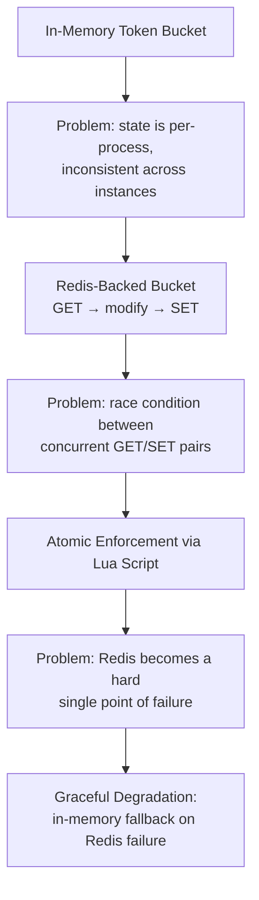

# Engineering Decisions

## Why this project?

Most side projects that demonstrate backend skills are CRUD applications — an API in front of a database. They're useful for showing you can wire up a service, but they don't force you to reason about concurrency, shared state, or failure.

A rate limiter does, especially once you stop assuming a single process. The moment there's more than one instance behind a load balancer, "count requests and reject over the limit" stops being a local counting problem and becomes a coordination problem: multiple processes need to agree on the same count, under concurrent access, without corrupting it. That's a small enough surface area to actually finish, but it touches concerns that show up in real production systems — shared state, atomicity, degradation under partial failure, and the trade-off between strict correctness and availability. That combination is why this project, rather than another CRUD service, was worth building.

---

## Architecture Evolution

The design didn't arrive fully formed. It moved through a few distinct stages, each one exposing a problem the previous stage didn't handle.



**In-memory bucket.** The first working version was a `map[string]*Bucket` guarded by a mutex, inside a single process. It correctly implements the token bucket algorithm, but it only proves the algorithm — it says nothing about the distributed problem the project is meant to solve. As soon as I pictured two instances behind a load balancer, it was obviously wrong: a client hitting both instances gets roughly double its intended quota.

**Redis-backed bucket.** The natural fix is to move the bucket out of process memory and into Redis, so every instance reads and writes the same state. The first pass at this did exactly what the in-memory version did, just against Redis: `GET` the bucket, refill and consume in application code, `SET` it back.

**Race condition.** That GET-modify-SET sequence is not atomic. Two instances can both read the same token count, both decide there's capacity, and both write back a decremented value — one of the decrements is lost, and the client gets more requests than the limit allows. This is the same lost-update problem that motivates database transactions, except here it's happening across a shared cache rather than a shared table.

**Lua.** This is the stage that actually fixed the problem, and is discussed in detail below.

**Graceful degradation.** Once Redis is the single source of truth, it also becomes a single point of failure — if Redis is down, does the service reject every request, or does it keep serving traffic with degraded guarantees? I hadn't originally treated this as part of the core design; it initially felt like a "nice to have." Once I'd solved atomicity, though, it was clear that a distributed rate limiter that hard-fails the moment Redis is unreachable isn't meaningfully more production-ready than the in-memory version it replaced. Handling that failure explicitly became part of the design, not an afterthought.

---

## Why Token Bucket?

Three well-known alternatives were on the table: Fixed Window, Sliding Window, and Leaky Bucket.

- **Fixed Window** is the simplest to implement — increment a counter, reset it every window — but it has a well-known boundary problem: a client can send a full window's worth of requests at the very end of one window and another full window's worth at the very start of the next, doubling its effective rate for a short burst around the boundary.
- **Sliding Window** (log or counter-based) fixes the boundary problem but at the cost of either storing a timestamp per request (memory grows with request volume) or approximating with more bookkeeping than the problem justifies for this project's scope.
- **Leaky Bucket** enforces a smooth, constant output rate, which is a good fit for traffic *shaping*, but it's a poor fit for an API rate limiter, where legitimate clients naturally send requests in bursts (e.g., a client loading several resources at once) and shouldn't be penalized for it.

Token Bucket sits in the middle: it allows short bursts up to the bucket's capacity while still enforcing a long-term average rate equal to the refill rate, it needs only two numbers of state per key (`tokens`, `last_refill`), and it's the algorithm most widely used in production rate limiters (API gateways, cloud provider throttling, etc.), which made it the more representative choice for a project meant to demonstrate production-inspired thinking.

---

## Why Redis?

Once the decision was made to share state across instances, the state has to live somewhere all instances can reach. An in-memory map was already ruled out for the reason above — it's local to a process, so it can't be the shared source of truth by definition.

Redis fits the requirement for a few concrete reasons:

- **Horizontal scaling** — any number of application instances can point at the same Redis instance, so adding instances doesn't fragment the rate-limiting state.
- **Low latency** — the token bucket check sits on the hot path of every request, so the shared store needs sub-millisecond reads and writes; Redis's in-memory design fits that constraint in a way a disk-backed database wouldn't.
- **Native support for atomic scripting** — this turned out to be the deciding factor, and is the subject of the next section.

---

## Why Lua?

This was the most important decision in the project, and the one that changed the design the most.

The naive Redis-backed implementation does:

```
GET bucket_state
  ↓
refill + consume in application code
  ↓
SET bucket_state
```

Under concurrent requests to the same key, this is a textbook race condition. Two goroutines — potentially in two different processes — can both execute the `GET` before either executes the `SET`. Both see the same token count, both decide a token is available, both consume it, and both write back a bucket with one fewer token than it should have — meaning one request that should have been denied gets allowed instead. The limiter silently becomes less strict than configured under load, which is exactly the scenario a rate limiter exists to prevent.

I initially assumed Redis's own atomicity — each individual command is atomic — would be enough, since Redis is single-threaded per command. It took reasoning through the concurrent-request scenario above to realize that atomicity of *individual* commands says nothing about atomicity of a *sequence* of commands; the race isn't inside `GET` or inside `SET`, it's in the gap between them.

Redis transactions (`MULTI`/`EXEC`) were a natural next candidate, but they don't actually solve this: a transaction guarantees the commands inside it execute without interleaving from other clients, but it can't make a decision that depends on a value read earlier in the same transaction — you can't `GET` inside a `MULTI` block and use that value to compute what to `SET`. `WATCH`-based optimistic locking gets closer, but adds complexity and retry logic for what is fundamentally a very small, deterministic piece of arithmetic.

Redis Lua scripting was the actual fix: the entire refill-and-consume sequence — read the bucket, compute the new token count, decide allow/deny, write the bucket back — executes as a single script on the Redis server, and Redis guarantees a script runs to completion without any other command interleaving. The check-and-consume operation becomes genuinely atomic, not just individually-atomic-per-step. Learning Redis Lua scripting was new to me going into this project, and it changed how I think about atomicity in distributed systems generally: atomicity isn't a property you get for free from using an atomic store, it's a property of *the operation you actually need*, and sometimes that means moving the operation to where the data lives rather than pulling the data to where the operation runs.

---

## Why Middleware?

Rate limiting is a cross-cutting concern — it applies to requests in general, not to the business logic of any specific handler. Implementing it as HTTP middleware (`RateLimitMiddleware.Handler`, composed around the router in `NewRouter`) keeps that concern separate from what a handler actually does: the `/health` handler has no awareness that it's being rate-limited at all.

This separation also means adding a new route later doesn't require re-implementing or even thinking about rate limiting — it's enforced by virtue of sitting behind the same middleware chain, the same way `LoggingMiddleware` wraps every request without every handler needing to log anything itself.

---

## Why Interface-driven Design?

The `Limiter` interface (`Allow(ctx, key, capacity, window) (*Result, error)`) is the seam the entire system is built around. `RateLimitMiddleware` depends on that interface, not on a concrete Redis or in-memory implementation, and both `RedisStore` and `MemoryTokenBucket` satisfy it.

That seam is what makes the fallback behavior possible at all: `RedisStore` holds a `MemoryTokenBucket` internally and can hand off to it on failure without the middleware — or anything above it — knowing that a switch happened. The same interface boundary also exists one layer down, in the `Store` interface that `MemoryTokenBucket` depends on (`Get`/`Save`), which decouples the bucket algorithm from where individual buckets are persisted.

The practical benefit is less about testability in the abstract and more concrete: the moment a second implementation (in-memory fallback) needed to exist alongside the first (Redis), the interface was what made that possible without conditional branching scattered through the middleware. The same seam would make it straightforward to add a third implementation later — for example, a limiter backed by a different store — without touching the HTTP layer.

---

## Why Docker?

The project needed to work in two genuinely different contexts: a single `go run ./cmd/server` against a local Redis for fast iteration, and a multi-instance deployment that actually demonstrates the problem the project is solving — because a single instance can't show why distributed coordination matters in the first place.

Docker Compose is what makes the second context possible without needing real infrastructure: `docker-compose.yml` brings up two application instances, a shared Redis, and an Nginx load balancer distributing traffic between them, which is the minimum topology needed to actually observe the shared-state behavior rather than just read about it. Designing for both — a fast local loop and a compose stack that mirrors a real deployment — wasn't something I'd deliberately planned for at the start; it became clear only once I wanted to be able to demonstrate the distributed behavior on demand, not just claim it works in theory.

---

## Why Graceful Degradation?

Once Redis holds the authoritative rate-limit state, a Redis outage puts the service in front of a decision with no neutral option:

- **Fail-closed** — reject requests (or fail the check) when Redis is unreachable. This preserves the rate limit guarantee exactly, at the cost of taking otherwise-healthy application instances out of service because of a dependency failure.
- **Fail-open / memory fallback** — fall back to a local, per-instance in-memory token bucket when Redis is unreachable. This keeps the service available and still enforces *a* limit, but that limit is no longer globally consistent — each instance is now counting independently, the same problem the project set out to solve in the first place, just scoped to the outage window instead of being permanent.

The project supports both, controlled by `REDIS_FAILURE_MODE`, rather than picking one and hard-coding it. That's a deliberate acknowledgment that the "right" answer depends on what's being protected: a payments endpoint probably wants fail-closed correctness, while a general API probably prefers degraded availability over an outright outage. Making it configuration rather than a fixed decision reflects that this is a trade-off the operator of the service should make, not one the rate limiter should make for them.

---

## Why Structured Logging?

`log/slog` is used throughout instead of `fmt.Println` or an ad hoc `log.Printf`. The specific reason is that rate-limiting decisions and failures are exactly the kind of event that needs to be *queryable*, not just readable: knowing that a request was denied is less useful than being able to filter every denial for a specific client, or every Redis fallback event, over a time range.

`slog`'s structured key-value fields (`"client", key, "allowed", result.Allowed, "latency", latency`) make that possible in a way string-formatted logs don't — the fields are attributes on the log line, not text embedded in a sentence, which is what makes logs machine-parseable by downstream tooling rather than just human-readable in a terminal. That's a small decision on its own, but it's the same underlying idea as the rest of the project: treat operational concerns (logging, failure handling) as things worth designing, not just outputting.

---

## Trade-offs

Being honest about the current state of the project:

- **No automated test suite.** The system was validated through manual, scenario-driven testing (startup, health checks, per-client limits, Redis verification, graceful shutdown — see the README screenshots) rather than unit or integration tests. For a project of this scope, that was an acceptable trade-off to prioritize getting the distributed-coordination logic correct first; it's the most significant gap for anyone evaluating this as production-track code.
- **Client identification is a single header.** Clients are identified by `X-API-Key`, with no authentication behind it — anyone can claim any key. That's fine for demonstrating the rate-limiting mechanism in isolation, but it means the "premium" tier in `client_limits.json` is not actually access-controlled.
- **The health endpoint doesn't check Redis.** `/health` currently returns a static "connected" status rather than performing a live check against the Redis client. It reports process liveness, not dependency health.
- **No metrics or tracing.** Structured logs exist, but there's no aggregated view of allow/deny rates, fallback frequency, or latency distributions — that currently requires reading logs rather than querying a dashboard.
- **Single Redis instance.** There's no Redis Cluster or replica failover; "Redis is down" is a binary condition rather than a partial-degradation scenario.

None of these were oversights discovered too late — they were scoped out deliberately to keep the project focused on the coordination problem (shared state, atomicity, degradation) rather than growing into a full platform.

---

## Things I Learned

- Getting the algorithm right (token bucket math) was the easy part; getting it right under concurrent, distributed access was the actual engineering problem.
- Redis is frequently reached for as a cache, but its scripting capability makes it a coordination primitive — the same properties that make it fast also make it a reasonable place to execute small atomic operations, not just store values.
- Failure handling isn't a layer you add on top of a design — deciding what happens when a dependency fails changes what "correct" even means for the system (fail-closed vs. fail-open aren't equally correct, they're different answers to different priorities).
- An interface only pays for itself once there's a second implementation behind it; the value of `Limiter` as an abstraction wasn't obvious until the memory fallback needed to exist alongside Redis.
- Local developer experience (a fast `go run` loop) and production-shaped deployment (multi-instance Compose stack) pull in different directions, and supporting both well takes deliberate structuring, not just "it also happens to work."

---

## Future Improvements

- **OpenTelemetry** — the logging middleware already captures latency and outcome per request; tracing would connect that to the Lua script execution specifically, making it possible to see how much of total latency is the Redis round-trip versus the rest of the request path.
- **Redis Cluster** — removes the single-Redis-instance limitation, turning a Redis node failure into a partial-degradation event handled by cluster failover instead of triggering the in-memory fallback path.
- **Authentication** — the `X-API-Key` header currently identifies a client without verifying it; adding real authentication would make the tiered `client_limits.json` policy actually enforceable rather than self-reported.
- **Dynamic configuration** — `client_limits.json` is read once at startup; reloading it (or backing it with Redis/a config service) would allow limits to change without a redeploy.
- **Metrics (Prometheus) and dashboards** — would turn the current log-based visibility into aggregate, queryable rate-limit and fallback statistics.
- **Circuit breaker around the Redis client** — currently every request that hits a failing Redis attempts the call and pays its timeout before falling back; a circuit breaker would short-circuit that cost once a failure pattern is detected.
- **Kubernetes deployment** — the Docker Compose setup demonstrates the multi-instance topology locally; a Kubernetes manifest (with a Service in front of multiple pods) would be the natural next step toward a realistic production deployment target.

## Final Thoughts

This project started as an implementation of the Token Bucket algorithm.

It gradually became an exercise in distributed systems, consistency, failure handling, and production-inspired backend design.

The algorithm itself turned out to be the easy part. The more interesting engineering challenges came from ensuring correctness across multiple application instances while designing for failures that inevitably occur in distributed systems.