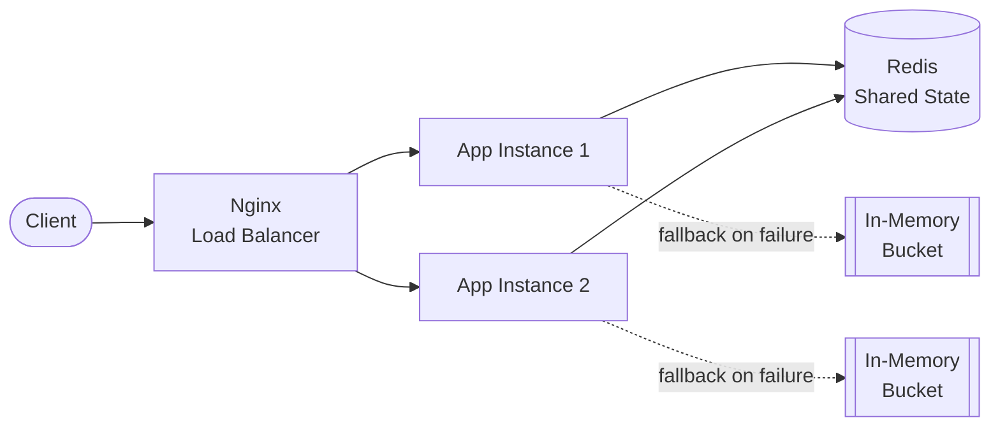
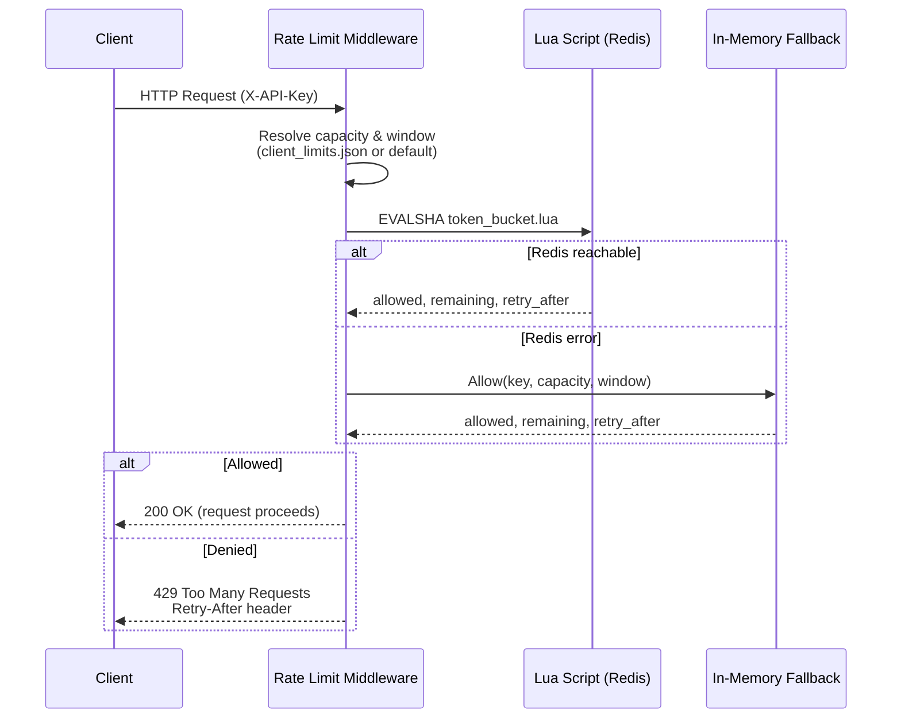

<div align="center">

# 🚦 Distributed Rate Limiter

**A production-inspired, Redis-backed distributed rate limiter written in Go.**

Atomic Lua-scripted token bucket enforcement, per-client policies, automatic in-memory failover, and a multi-instance Nginx-fronted Docker deployment.

[](go.mod)
[](internal/redis)
[](internal/script/token_bucket.lua)
[](docker-compose.yml)
[](nginx.conf)
[](LICENSE)
[](#-architecture)

</div>

---

## 🎯 Why This Project?

Modern backend services rarely run on a single server.

Once traffic is distributed across multiple application instances, traditional in-memory rate limiters become inconsistent because every instance maintains its own request counters.

This project explores how production systems solve that problem by combining:

- Shared state with Redis
- Atomic request enforcement using Lua scripts
- Middleware-based rate limiting
- Graceful degradation during Redis outages
- Multi-instance deployment behind Nginx

The result is a production-inspired distributed rate limiter that demonstrates backend engineering concepts beyond a typical CRUD application.

---

## Overview

Most rate limiters start out simple: a counter in memory, incremented per request. That works fine — until the service is scaled horizontally. Once traffic is split across multiple instances behind a load balancer, each instance ends up enforcing its *own* limit, and a client can silently get several times the intended quota just by hitting different servers.

**Distributed Rate Limiter** solves this by moving rate-limiting state out of the process and into Redis, where every application instance reads and writes against the same source of truth. The core enforcement logic — checking, refilling, and consuming tokens — runs as a single atomic Lua script inside Redis, eliminating the race conditions that plague naive "read-then-write" implementations under concurrent load.

The project also treats Redis as a dependency that *can* fail. Rather than taking the whole service down when Redis is unreachable, the limiter can fall back to a local in-memory token bucket, trading strict global consistency for continued availability — a deliberate, configurable trade-off rather than an accident.

---

## 🚀 Start Here

New to this repository? Here's the recommended path:

1. Skim [✨ Features](#-features) and [🏗 Architecture](#-architecture) below
2. Look at the [📸 Screenshots](#-screenshots) to see it running end-to-end
3. Read **[ENGINEERING_DECISIONS.md](ENGINEERING_DECISIONS.md)** for the request flow, algorithm rationale, and trade-offs
4. Explore the source, starting at [`cmd/server/main.go`](cmd/server/main.go)

---

## ✨ Features

**Distributed Systems**
- Shared rate-limit state across instances via Redis
- Atomic check-and-consume using a single Lua script (no read-modify-write races)
- Per-instance automatic fallback to an in-memory limiter on Redis failure

**Backend Engineering**
- Middleware-based enforcement, decoupled from the limiter implementation via a `Limiter` interface
- Per-client rate limit overrides, loaded from `client_limits.json` and resolved by `X-API-Key`
- Environment-driven configuration with `.env` support

**Reliability**
- Configurable failure mode (`memory` fallback vs. fail-closed) when Redis is unavailable
- Graceful shutdown on `SIGINT`/`SIGTERM` with a bounded drain window
- Structured request logging (method, path, status, latency, remote address)

**Developer Experience**
- Minimal, idiomatic Go project layout (`cmd/`, `internal/`)
- Clear separation between transport (`api`), policy (`limiter`), and persistence (`storage`, `redis`)

**Containerization**
- Multi-stage Docker build producing a small Alpine runtime image
- Docker Compose stack: two app instances, Redis, and an Nginx load balancer

---

## 🏗 Architecture

### System Overview



Every instance is stateless with respect to rate limiting — the authoritative token bucket for a given client lives in Redis, keyed by client identity. If Redis becomes unreachable, each instance can independently drop back to a local bucket to keep serving traffic.

### 🏛️ Highlights

- Stateless Go application instances
- Redis as the single source of truth
- Atomic Lua execution for consistency
- Interface-driven architecture
- Graceful degradation on dependency failures
- Containerized multi-instance deployment

### Request Flow



Capacity and window resolution, Lua script internals, and the fallback decision logic are covered step-by-step in **[ENGINEERING_DECISIONS.md](ENGINEERING_DECISIONS.md)**.

---

## ⚡ Why This Project

- **Horizontal scaling** — the system is designed around the assumption that there will be more than one instance, not as an afterthought.
- **Shared state, not shared memory** — Redis is used deliberately as the coordination point, rather than reaching for something like a distributed lock.
- **Atomicity over locking** — the token bucket's read-refill-consume sequence executes as one Lua script inside Redis, avoiding the classic distributed race condition of two instances reading the same count before either writes back.
- **Middleware, not a library call** — enforcement is wired in as standard HTTP middleware, so it composes with routing the way production systems actually do.
- **Failure is a first-class case** — the failure mode (memory fallback vs. fail-closed) is explicit configuration, not an implicit default.

---

## 📸 Demo

<p align="center"><b>Application Startup</b><br/>
<br/>
<sub>Configuration loading, Redis connection, and middleware initialization on boot.</sub>
</p>

<p align="center"><b>Health Endpoint</b><br/>
<br/>
<sub>The <code>/health</code> endpoint responding behind the logging and rate-limit middleware chain.</sub>
</p>

<p align="center"><b>Per-Client Rate Limiting</b><br/>

<br/>
<sub>Free vs. premium clients enforced against different capacities defined in <code>client_limits.json</code>.</sub>
</p>

<p align="center"><b>Redis Data Verification</b><br/>
<br/>
<sub>Token bucket state persisted as a Redis hash, written atomically by the Lua script.</sub>
</p>

<p align="center"><b>Graceful Shutdown</b><br/>
<br/>
<sub>In-flight requests draining cleanly on <code>SIGTERM</code> before the process exits.</sub>
</p>

---

## 📂 Project Structure

```text
distributed-rate-limiter/
├── cmd/server/        # Application entrypoint
├── internal/
│   ├── api/            # HTTP router, rate-limit & logging middleware, health handler
│   ├── config/          # Env + client_limits.json loading
│   ├── limiter/          # Limiter interface, in-memory token bucket
│   ├── logger/            # Structured logging (log/slog)
│   ├── redis/              # Redis client wrapper
│   ├── script/              # Embedded Lua script
│   └── storage/              # Redis-backed and in-memory stores
├── docs/                      # Algorithm notes
├── docker-compose.yml         # Multi-instance + Nginx + Redis stack
├── Dockerfile
└── nginx.conf
```

Package-level responsibilities and how they interact are detailed in **[ENGINEERING_DECISIONS.md](ENGINEERING_DECISIONS.md)**.

---

## ⚙️ Configuration

**`.env`** — global defaults, loaded on startup:

```env
PORT=8080
REDIS_ADDR=localhost:6379
REDIS_FAILURE_MODE=memory   # "memory" (fallback) or fail-closed
DEFAULT_RATE_LIMIT=10
RATE_LIMIT_WINDOW=1m
```

**`client_limits.json`** — per-client overrides, matched against the `X-API-Key` header:

```json
{
  "free":    { "capacity": 10,  "window": "1m" },
  "premium": { "capacity": 100, "window": "1m" }
}
```

Requests without an `X-API-Key` header are limited under a shared `global` key using the default capacity and window.

---

## 🛠 Tech Stack

| Layer               | Technology                  |
|---------------------|------------------------------|
| Language            | Go 1.24                      |
| Shared State        | Redis 7                      |
| Atomic Enforcement  | Lua (via `go-redis` scripting) |
| Redis Client        | `github.com/redis/go-redis/v9` |
| HTTP                | `net/http`                   |
| Logging             | `log/slog`                   |
| Load Balancing      | Nginx                        |
| Containerization    | Docker, Docker Compose       |

---

## 🚀 Quick Start

### Docker Compose (recommended — full multi-instance stack)

```bash
git clone https://github.com/<your-username>/distributed-rate-limiter.git
cd distributed-rate-limiter
docker compose up --build
```

This brings up two app instances, Redis, and Nginx as a load balancer on `localhost:8080`.

### Local (Go)

```bash
go mod tidy
docker compose up redis   # Redis only
go run ./cmd/server
```

---

## 📖 Engineering Decisions

The README stays focused on *what* this project is and *why* it exists. The *how* — request flow internals, Lua script design, failure-mode trade-offs, and architectural alternatives considered — lives in a dedicated document:

➡️ **[ENGINEERING_DECISIONS.md](ENGINEERING_DECISIONS.md)**

It covers:
- Detailed request/response flow
- Token bucket algorithm and Lua implementation
- Redis failure handling trade-offs
- Design decisions and alternatives considered

---

## 🔮 Future Improvements

- OpenTelemetry tracing across the middleware chain
- Prometheus metrics and Grafana dashboards
- Redis Cluster support for horizontal Redis scaling
- Kubernetes deployment manifests
- Dynamic (hot-reloadable) client limit configuration
- Authentication on top of the existing API-key-based identification
- Automated unit and integration test suite
- Circuit breaker around the Redis client

---

## 🤝 Contributing

Issues, suggestions, and pull requests are welcome. If you'd like to propose a change to the architecture or algorithm, opening an issue first is a good way to start the discussion.

---

## 📄 License

Distributed under the MIT License.
